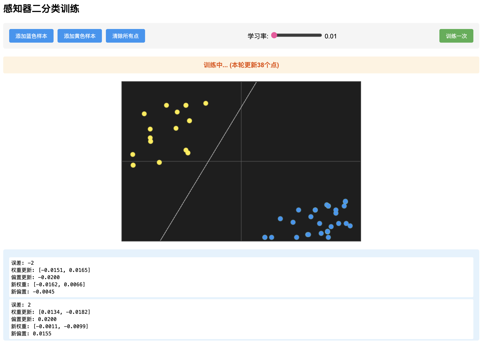

# 尝试一下前向传播的过程

## 输入调整参数版本

## [点击此处尝试前向传播](https://s1lently.github.io/perceptron-forward.html)

***

## 滑动调整参数版本

## [点击此处尝试前向传播](https://s1lently.github.io/perceptron-slider.html)

***

<figure><figcaption></figcaption></figure>

## 形象地看到完整的训练过程 -> 完美的函数拟合器

## [点击体验反向传播](https://s1lently.github.io/simple-perceptron.html)
